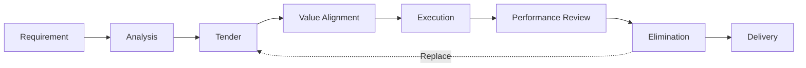
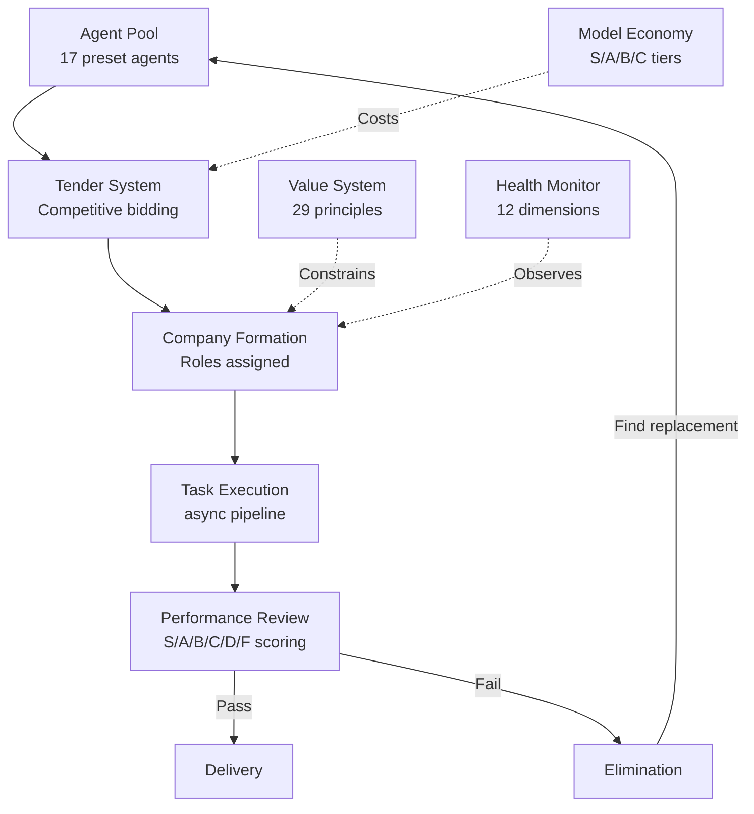

<!-- 🏢 Agent Company -->

# Agent Company

**The Tendering-Based AI Agent Company Framework** — Where AI agents compete for roles, get performance-reviewed, and underperformers get replaced.

> *Hire AI. Fire AI. Ship faster.*


**English** | [中文](README_zh.md)

---

## How It Works (30 seconds)



---

## Why Agent Company?

| | **Agent Company** | CrewAI / AutoGen / MetaGPT |
|---|---|---|
| **Role Assignment** | Competitive tendering — agents bid and get scored | Static assignment — you pick who does what |
| **Team Dynamics** | Performance-based elimination — underperformers get fired and replaced mid-run | Fixed team — stuck with whoever you configured |
| **Behavior Control** | Value-driven governance — 29 principles as hard constraints on agent behavior | Prompt-only — hope your system prompt holds up |

---

## Quick Start

```bash
pip install -e packages/core

# Run a full tendering pipeline
python examples/full_tender_demo.py

# Or use the CLI
pip install -e packages/cli
agent-co run "Build a todo app" --budget 20
```

---

## Architecture



---

## Features

| Feature | Description |
|---------|-------------|
| **Competitive Tendering** | Agents scored by: Skill Match 30% + History 25% + Value Fit 20% + Team Compat 15% + Cost Efficiency 10% |
| **Agent Pool** | 17 preset agents with persistent performance profiles across projects |
| **Value Governance** | 29 behavioral principles from 10 top companies — enforced, not suggested |
| **Performance System** | Three-tier KPIs (company / role / individual), S/A/B/C/D/F grading |
| **Elimination** | Single F = immediate removal. Two consecutive D = removal. Auto-replacement from pool |
| **Model Economy** | S/A/B/C model tiers as salary grades. Capability = Base Skill x Model Multiplier |
| **12-Dim Health** | Organizational health scored across 12 scientific dimensions |
| **Industry Templates** | 6 ready-to-use templates: Software, Publishing, Consulting, Education, Design, Finance |
| **Multi-Model** | Anthropic Claude, OpenAI GPT, Ollama local models |

---

## Model Economy

| Tier | Representative Models | Best For | Capability Score |
|------|----------------------|----------|-----------------|
| **S** | Claude Opus, GPT-4o | CEO, CTO, Lead Editor | 92–98 |
| **A** | Claude Sonnet, GPT-4o-mini | Senior Engineer, Author | 80–85 |
| **B** | Claude Haiku, Qwen 32B | Junior Engineer, Proofreader | 70–72 |
| **C** | Qwen 7B, LLaMA 3B | Assistant, Classification | 45–55 |

---

## Value System

29 principles extracted from 10 world-class companies and 6 classic business books:

| Category | Example Principle | Source |
|----------|------------------|--------|
| Excellence | Insist on the Highest Standards | Amazon LP #7 |
| Transparency | Radical Transparency | Bridgewater / Ray Dalio |
| Ownership | Begin with the End in Mind | ByteDance |
| Decision Quality | First Principles Thinking | Tesla / Elon Musk |
| Continuous Learning | Growth Mindset | Microsoft / Satya Nadella |
| Collaboration | No Brilliant Jerks | Netflix |
| Long-term Thinking | Flywheel Effect | Good to Great / Jim Collins |

---

## 12-Dimension Health Monitor

The company is continuously evaluated across 12 dimensions drawn from organizational science, sociology, business theory, and psychology:

1. Strategic Alignment
2. Execution Velocity
3. Communication Quality
4. Decision Effectiveness
5. Innovation Index
6. Resource Utilization
7. Team Cohesion
8. Knowledge Flow
9. Adaptability
10. Value Adherence
11. Stakeholder Satisfaction
12. Sustainability

---

## Project Structure

```
agent-company/
├── packages/
│   ├── core/               # Core SDK
│   │   └── src/agent_company/
│   │       ├── pool/       # Agent talent pool
│   │       ├── agent/      # Agent execution engine
│   │       ├── org/        # Organization (company/dept/role/governance)
│   │       ├── comm/       # Communication (message bus/channels)
│   │       ├── task/       # Task system (workflow/scheduling)
│   │       ├── llm/        # LLM abstraction (Anthropic/OpenAI/Ollama)
│   │       ├── values/     # Value system
│   │       ├── economy/    # Model economy
│   │       ├── tender/     # Tendering system
│   │       ├── performance/# Performance review
│   │       ├── health/     # 12-dimension health monitor
│   │       └── config/     # Configuration
│   ├── cli/                # CLI tool (agent-co)
│   ├── server/             # FastAPI REST API
│   └── dashboard/          # React Web UI
├── templates/              # Industry template YAMLs
├── examples/               # Usage examples
└── configs/                # Global configuration
```

---

## Tech Stack

| Layer | Stack |
|-------|-------|
| Core | Python 3.10+, Pydantic v2, asyncio |
| Server | FastAPI + WebSocket |
| Dashboard | React 18 + Vite + TypeScript + Tailwind CSS |
| CLI | Click + Rich |

---

## Roadmap (v0.3)

- [ ] **Inter-company collaboration** — Multiple Agent Companies working on the same project
- [ ] **Agent marketplace** — Community-contributed agents with verified performance history
- [ ] **Adaptive value calibration** — Auto-tune value weights based on project type
- [ ] **Real-time dashboard** — Live WebSocket-powered monitoring of company operations

---

## Contributing

We welcome contributions! Please see [CONTRIBUTING.md](CONTRIBUTING.md) for guidelines.

---

## License

[Apache-2.0](LICENSE)

---

<p align="center">
  <sub>Built with the belief that AI teams should earn their roles, not just be assigned them.</sub>
</p>
