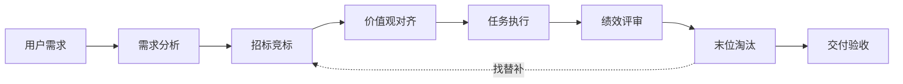
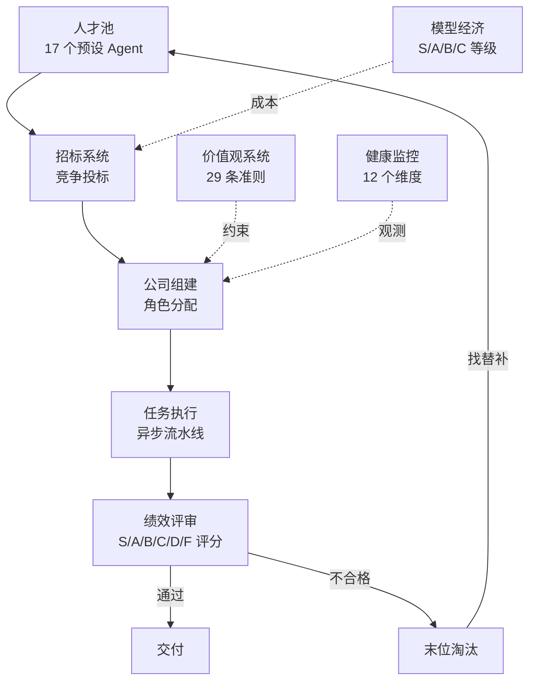

<!-- 🏢 Agent Company -->

# Agent Company

**招标制 AI Agent 公司框架** — Agents 竞争上岗，绩效淘汰，像经营真公司一样运行 AI 团队。

> *Hire AI. Fire AI. Ship faster.*


[English](README.md) | **中文**

---

## 30 秒理解



---

## 为什么选 Agent Company？

| | **Agent Company** | CrewAI / AutoGen / MetaGPT |
|---|---|---|
| **角色分配** | 招标竞争 — Agent 投标，评分矩阵打分 | 静态指定 — 你来决定谁干什么 |
| **团队动态** | 绩效淘汰 — 表现差直接换人 | 固定团队 — 配好了就不动了 |
| **行为约束** | 价值观治理 — 29 条准则作为硬约束 | 纯靠 Prompt — 系统提示词能撑多久？ |

---

## 快速开始

```bash
pip install -e packages/core

# 运行完整招标流程
python examples/full_tender_demo.py

# 或使用 CLI
pip install -e packages/cli
agent-co run "开发一个待办事项应用" --budget 20
```

```bash
# Live Demo（不需要 API Key）
python examples/live_demo.py --mock
```

---

## 架构



---

## 核心特性

| 特性 | 说明 |
|------|------|
| **招标组建** | 5 维评分矩阵：技能匹配 30% + 历史绩效 25% + 价值观契合 20% + 团队兼容 15% + 模型效率 10% |
| **人才池** | 17 个预设 Agent，跨项目持久化绩效档案 |
| **价值观治理** | 29 条行为准则来自 10 家顶级企业 — 是硬约束，不是装饰 |
| **绩效考核** | 三层 KPI（公司/角色/个人），S/A/B/C/D/F 六级评分 |
| **末位淘汰** | 单次 F 立即淘汰，连续 2 次 D 淘汰，自动从池中补人 |
| **模型经济** | S/A/B/C 模型等级 = 薪资等级，能力 = 基础技能 × 模型乘数 |
| **十二维健康度** | 从组织学、社会学、商业、心理学等 12 个维度评估 |
| **行业模板** | 6 个即用模板：软件、出版、咨询、教育、设计、金融 |
| **多模型支持** | Anthropic Claude / OpenAI GPT / Ollama 本地模型 |

---

## 模型等级

| 等级 | 代表模型 | 适合角色 | 能力分 |
|------|---------|---------|--------|
| **S** | Claude Opus, GPT-4o | CEO, CTO, 主编 | 92–98 |
| **A** | Claude Sonnet, GPT-4o-mini | 高级工程师, 作者 | 80–85 |
| **B** | Claude Haiku, Qwen 32B | 初级工程师, 校对 | 70–72 |
| **C** | Qwen 7B, LLaMA 3B | 助理, 分类任务 | 45–55 |

---

## 价值观体系

从 10 家顶级企业和 6 本经典商业书籍提炼的 29 条准则：

| 分类 | 代表原则 | 来源 |
|------|---------|------|
| 卓越标准 | 坚持最高标准 | Amazon LP #7 |
| 诚实透明 | 极度透明 | Bridgewater / Ray Dalio |
| 主人翁精神 | 以终为始 | 字节跳动 |
| 决策质量 | 第一性原理 | Tesla / Elon Musk |
| 持续学习 | 成长型思维 | Microsoft / Satya Nadella |
| 协作精神 | 不要聪明的混蛋 | Netflix |
| 长期主义 | 飞轮效应 | 《从优秀到卓越》/ Jim Collins |

---

## 十二维健康监控

从组织科学、社会学、商业理论、心理学等领域构建的健康评估体系：

1. 战略一致性
2. 执行速度
3. 沟通质量
4. 决策有效性
5. 创新指数
6. 资源利用率
7. 团队凝聚力
8. 知识流动
9. 适应能力
10. 价值观遵守
11. 利益方满意度
12. 可持续性

---

## 项目结构

```
agent-company/
├── packages/
│   ├── core/               # 核心 SDK
│   │   └── src/agent_company/
│   │       ├── pool/       # Agent 人才池
│   │       ├── agent/      # Agent 执行引擎
│   │       ├── org/        # 组织结构（公司/部门/角色/治理）
│   │       ├── comm/       # 通信层（消息总线/频道）
│   │       ├── task/       # 任务系统（流程/调度）
│   │       ├── llm/        # LLM 抽象层（Anthropic/OpenAI/Ollama）
│   │       ├── values/     # 价值观体系
│   │       ├── economy/    # 模型经济
│   │       ├── tender/     # 招标系统
│   │       ├── performance/# 绩效考核
│   │       ├── health/     # 十二维健康监控
│   │       └── config/     # 配置管理
│   ├── cli/                # 命令行工具 (agent-co)
│   ├── server/             # FastAPI REST API
│   └── dashboard/          # React Web UI
├── templates/              # 行业模板 YAML
├── examples/               # 使用示例
└── notebooks/              # 交互式教程
```

---

## 技术栈

| 层 | 技术 |
|----|------|
| 核心 | Python 3.10+, Pydantic v2, asyncio |
| 服务端 | FastAPI + WebSocket |
| 前端 | React 18 + Vite + TypeScript + Tailwind CSS |
| CLI | Click + Rich |

---

## 路线图 (v0.3)

- [ ] **跨公司协作** — 多个 Agent Company 协同工作
- [ ] **Agent 市场** — 社区贡献 Agent，带认证绩效记录
- [ ] **自适应价值观校准** — 根据项目类型自动调整价值观权重
- [ ] **实时 Dashboard** — WebSocket 驱动的实时运行监控

---

## 参与贡献

欢迎贡献！请查看 [CONTRIBUTING.md](CONTRIBUTING.md) 了解详情。

---

## 许可证

[Apache-2.0](LICENSE)

---

<p align="center">
  <sub>我们相信 AI 团队应该通过竞争赢得岗位，而不是被随意指派。</sub>
</p>
