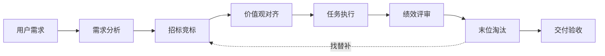
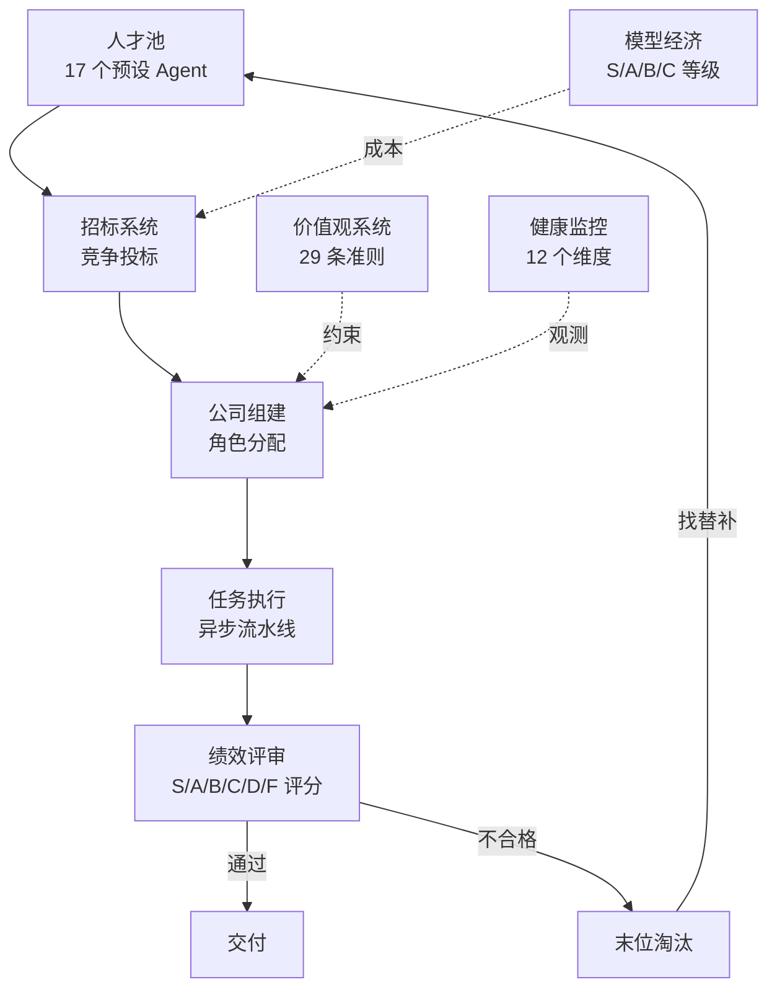

<!-- 🏢 Agent Company -->

# Agent Company

**招标制 AI Agent 公司框架** — Agents 竞争上岗，绩效淘汰，像经营真公司一样运行 AI 团队。

> *Hire AI. Fire AI. Ship faster.*


[English](README.md) | **中文**

---

## 30 秒理解



---

## 为什么选 Agent Company？

| | **Agent Company** | CrewAI / AutoGen / MetaGPT |
|---|---|---|
| **角色分配** | 招标竞争 — Agent 投标，评分矩阵打分 | 静态指定 — 你来决定谁干什么 |
| **团队动态** | 绩效淘汰 — 表现差直接换人 | 固定团队 — 配好了就不动了 |
| **行为约束** | 价值观治理 — 29 条准则作为硬约束 | 纯靠 Prompt — 系统提示词能撑多久？ |

---

## 快速开始

```bash
git clone https://github.com/quizD/agent-company.git
cd agent-company
pip install -e packages/core

# 运行 Demo（无需 API Key）
python examples/live_demo.py --mock

# 接入真实 LLM（支持任何 OpenAI 兼容 API）
export OPENAI_API_BASE="https://your-api-endpoint/v1"
export OPENAI_API_KEY="your-key"
export OPENAI_MODEL="your-model"
python examples/live_demo.py --provider openai
```

<details>
<summary><strong>Demo 输出示例（点击展开）</strong></summary>

```
╔══════════════════════════════════════════════════════════════╗
║ Agent Company — Live Demo                                    ║
╚══════════════════════════════════════════════════════════════╝

Step 1 │ 人才池总览 (17 个 Agent)
Step 2 │ 需求分析 → 内容出版 / 中等复杂度
Step 3 │ 招标过程
         ╭────────┬──────┬──────────┬──────╮
         │ 何严   │ 主编 │    A     │ 49.9 │
         │ 陈妙言 │ 作者 │    B     │ 55.7 │
         │ 林墨白 │ 作者 │    A     │ 52.9 │
         │ 苏晚晴 │ 校对 │    A     │ 39.5 │
         ╰────────┴──────┴──────────┴──────╯
Step 4 │ 价值观对齐 (7 条准则生效)
Step 5 │ LLM 执行 → 4 个 Agent 产出真实内容
Step 6 │ 绩效评审 → 2个 D 级, 2个 F 级
Step 7 │ 健康度评估 → 57.2/100

         ╭──────────────┬───────────────────╮
         │ LLM 调用次数 │ 4 次              │
         │ 总成本       │ $0.03             │
         │ 总耗时       │ 79.2 秒           │
         ╰──────────────┴───────────────────╯
```

</details>

实测效果：使用 GLM-5.1 模型，4 个 Agent 协作完成了一篇 AI Agent 技术博客，总成本 $0.03，耗时 79 秒。

---

## 架构



---

## 核心特性

| 特性 | 说明 |
|------|------|
| **招标组建** | 5 维评分矩阵：技能匹配 30% + 历史绩效 25% + 价值观契合 20% + 团队兼容 15% + 模型效率 10% |
| **人才池** | 17 个预设 Agent，跨项目持久化绩效档案 |
| **价值观治理** | 29 条行为准则来自 10 家顶级企业 — 是硬约束，不是装饰 |
| **绩效考核** | 三层 KPI（公司/角色/个人），S/A/B/C/D/F 六级评分 |
| **末位淘汰** | 单次 F 立即淘汰，连续 2 次 D 淘汰，自动从池中补人 |
| **模型经济** | S/A/B/C 模型等级 = 薪资等级，能力 = 基础技能 × 模型乘数 |
| **十二维健康度** | 从组织学、社会学、商业、心理学等 12 个维度评估 |
| **行业模板** | 6 个即用模板：软件、出版、咨询、教育、设计、金融 |
| **多模型支持** | Anthropic Claude / OpenAI GPT / Ollama 本地模型 |

---

## 模型等级

| 等级 | 代表模型 | 适合角色 | 能力分 |
|------|---------|---------|--------|
| **S** | Claude Opus, GPT-4o | CEO, CTO, 主编 | 92–98 |
| **A** | Claude Sonnet, GPT-4o-mini | 高级工程师, 作者 | 80–85 |
| **B** | Claude Haiku, Qwen 32B | 初级工程师, 校对 | 70–72 |
| **C** | Qwen 7B, LLaMA 3B | 助理, 分类任务 | 45–55 |

---

## 价值观体系

从 10 家顶级企业和 6 本经典商业书籍提炼的 29 条准则：

| 分类 | 代表原则 | 来源 |
|------|---------|------|
| 卓越标准 | 坚持最高标准 | Amazon LP #7 |
| 诚实透明 | 极度透明 | Bridgewater / Ray Dalio |
| 主人翁精神 | 以终为始 | 字节跳动 |
| 决策质量 | 第一性原理 | Tesla / Elon Musk |
| 持续学习 | 成长型思维 | Microsoft / Satya Nadella |
| 协作精神 | 不要聪明的混蛋 | Netflix |
| 长期主义 | 飞轮效应 | 《从优秀到卓越》/ Jim Collins |

---

## 十二维健康监控

从组织科学、社会学、商业理论、心理学等领域构建的健康评估体系：

1. 战略一致性
2. 执行速度
3. 沟通质量
4. 决策有效性
5. 创新指数
6. 资源利用率
7. 团队凝聚力
8. 知识流动
9. 适应能力
10. 价值观遵守
11. 利益方满意度
12. 可持续性

---

## 自主配置

所有配置集中在 `configs/` 目录 — 编辑 YAML 即可自定义一切：

```
configs/
├── agents.yaml    # Agent 性格、技能、模型分配
├── models.yaml    # LLM 模型等级和定价
└── values.yaml    # 行为准则（增删改）
```

**示例：修改 Agent 性格**

```yaml
# configs/agents.yaml
- name: "林墨白"
  model_tier: A
  llm_model: "claude-sonnet-4-20250514"
  personality:
    openness: 0.9        # 更有创造力
    conscientiousness: 0.7
  skills:
    technical_writing: 0.95
```

**使用自定义配置目录：**

```bash
python examples/live_demo.py --mock --config ./my_configs/
```

如果 `configs/` 不存在，框架自动降级到内置默认值。

---

## Agent 市场

社区贡献的 Agent 以 `.agent.yaml` 卡片形式发布、检索、安装：

```bash
python examples/marketplace_demo.py
```

**卡片结构：**

```yaml
metadata:
  card_id: community/writer-zh        # author/agent-name
  version: 0.1.0
  author: community
  description: 中文技术写作专家
  tags: [writer, chinese, technical]
profile:                              # 完整 AgentProfile
  name: 林墨白
  category: writer
  skills: { technical_writing: 0.92 }
  personality: { openness: 0.85, ... }
  model_tier: A
attestations:                         # 认证绩效履历
  - project_id: blog-2025-q1
    score: 92.0
    grade: A
    attested_by: verified
```

**核心 API：**

```python
from agent_company.marketplace import MarketplaceRegistry, CardMetadata

registry = MarketplaceRegistry("./marketplace")

# 浏览 / 搜索
cards = registry.list_agents()
results = registry.search("python", tags=["engineer"], min_avg_score=85.0)

# 安装到本地人才池
registry.install("community/writer-zh", pool)

# 发布
registry.publish(profile, CardMetadata(card_id="me/my-agent", author="me"))

# 追加认证
registry.attest("me/my-agent", attestation)
```

每张卡片有 SHA-256 指纹，用于检测篡改。`marketplace/` 目录下提供了 3 张示例卡片。

---

## 项目结构

```
agent-company/
├── packages/
│   ├── core/               # 核心 SDK
│   │   └── src/agent_company/
│   │       ├── pool/       # Agent 人才池
│   │       ├── agent/      # Agent 执行引擎
│   │       ├── org/        # 组织结构（公司/部门/角色/治理）
│   │       ├── comm/       # 通信层（消息总线/频道）
│   │       ├── task/       # 任务系统（流程/调度）
│   │       ├── llm/        # LLM 抽象层（Anthropic/OpenAI/Ollama）
│   │       ├── values/     # 价值观体系
│   │       ├── economy/    # 模型经济
│   │       ├── tender/     # 招标系统
│   │       ├── performance/# 绩效考核
│   │       ├── health/     # 十二维健康监控
│   │       └── config/     # 配置管理
│   ├── cli/                # 命令行工具 (agent-co)
│   ├── server/             # FastAPI REST API
│   └── dashboard/          # React Web UI
├── templates/              # 行业模板 YAML
├── examples/               # 使用示例
└── notebooks/              # 交互式教程
```

---

## 技术栈

| 层 | 技术 |
|----|------|
| 核心 | Python 3.10+, Pydantic v2, asyncio |
| 服务端 | FastAPI + WebSocket |
| 前端 | React 18 + Vite + TypeScript + Tailwind CSS |
| CLI | Click + Rich |

---

## 路线图 (v0.3)

- [ ] **跨公司协作** — 多个 Agent Company 协同工作
- [x] **Agent 市场** — 社区贡献 Agent，带认证绩效记录
- [ ] **自适应价值观校准** — 根据项目类型自动调整价值观权重
- [ ] **实时 Dashboard** — WebSocket 驱动的实时运行监控

---

## 参与贡献

欢迎贡献！请查看 [CONTRIBUTING.md](CONTRIBUTING.md) 了解详情。

---

## 许可证

[Apache-2.0](LICENSE)

---

<p align="center">
  <sub>我们相信 AI 团队应该通过竞争赢得岗位，而不是被随意指派。</sub>
</p>
